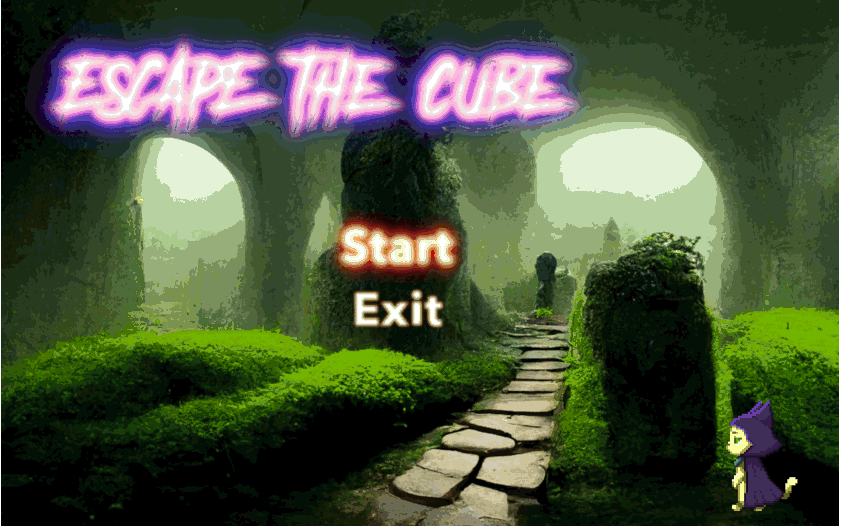

# ESCAPE THE CUBE
Projet Cube 3D - Ecole 42 Perpignan

## Be prepared to face your biggest fears !

### Requirements
run:
> sudo apt install -y build-essential cmake libx11-dev libxext-dev zlib1g-dev libbsd-dev


To compile:
go into 'Bonus'
> make all

run with
> ./cube3d

list of commands :
> ./cube3d help

This is the final version with bonuses, I won't give you the easy simple version !

Items, chainsaw, SOUNDS..

### Controls :
W > up | A > left | S > down | D > right |
Shift > run | Space > attack

You should be able to use the mouse to rotate and attack but under some systems it doesn't work properly so use Q and E instead. 
If you are using a VM, it can cause this problem, try disabling mouse integration (automatic switching between host and VM)

### If you get this error :
```
Parent window has XID 0x2c5
Found child window with XID 0x60000a
Move window = 1
Move window = 1
munmap_chunk(): invalid pointer
[1]    20008 IOT instruction (core dumped)  ./cube3d
```
Try running this 
> ./cube3d diswin

## Works under linux


